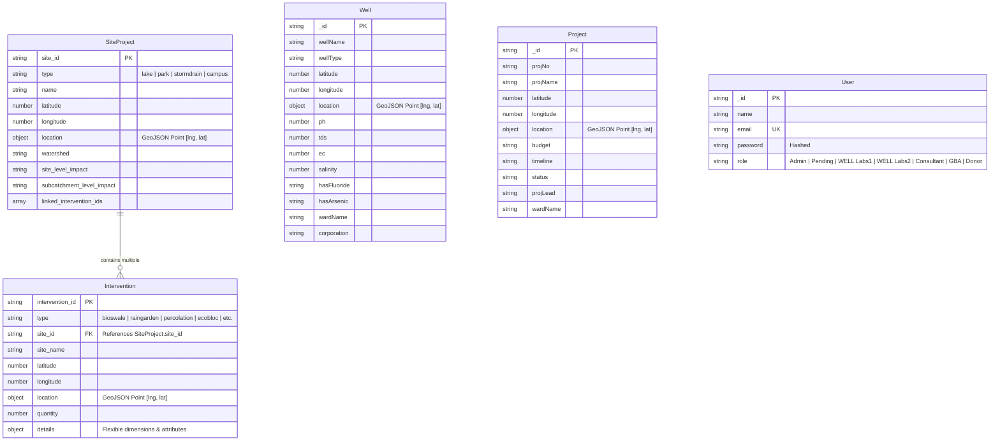

# Database Schema & Data Dictionary — Solution Explorer

The **Solution Explorer** database uses **MongoDB** managed via **Mongoose**. It relies on GeoJSON standards and geospatial `2dsphere` indexes to query location-based infrastructure and groundwater data.

---

## 🗄 Entity Relationship & Linkage Model

---

## 📋 Collection Schemas

### 1. `SiteProject` Collection
Represents physical sites where Blue-Green-Grey interventions are planned or deployed.

| Field | Type | Index | Description |
| :--- | :--- | :--- | :--- |
| `site_id` | String | Unique, Indexed | Unique identifier for the site (e.g., `PARK_001`, `LAKE_002`). |
| `type` | String | Indexed | Category: `'park'` (Green), `'lake'` (Blue), `'stormdrain'` (Grey), or `'campus'`. |
| `name` | String | - | Name of the site or landmark. |
| `latitude` | Number | - | Decimal latitude. |
| `longitude` | Number | - | Decimal longitude. |
| `location` | GeoJSON Point | `2dsphere` | `{ type: "Point", coordinates: [lng, lat] }` for spatial queries. |
| `watershed` | String | - | Micro-watershed name (e.g., `"Nallurhalli Micro Watershed"`). |
| `site_level_impact` | String | - | Expected site-level environmental/water impact description. |
| `subcatchment_level_impact` | String | - | Expected subcatchment impact description. |
| `linked_intervention_ids` | Array[String] | Indexed | Array of `intervention_id` values associated with this site. |
| `needs_review` | Boolean | - | Flag indicating manual verification required. |
| `review_reason` | String | - | Reason for review flag. |

---

### 2. `Intervention` Collection
Represents individual nature-based or engineering interventions within a site.

| Field | Type | Index | Description |
| :--- | :--- | :--- | :--- |
| `intervention_id` | String | Unique, Indexed | Unique identifier for the intervention. |
| `type` | String | Indexed | Category: `bioswale`, `raingarden`, `infiltration_trench`, `percolation`, `detention_basin`, `constructed_wetlands`, `rainwater_harvesting`, `permeable_pathway`, `ecobloc`, `tree_trench`, `swd_inlet`, `underground_tank`, `other`. |
| `site_id` | String | Indexed | Foreign key linking to parent `SiteProject.site_id`. |
| `site_name` | String | - | Denormalized parent site name for fast retrieval. |
| `latitude` | Number | - | Decimal latitude. |
| `longitude` | Number | - | Decimal longitude. |
| `location` | GeoJSON Point | `2dsphere` | `{ type: "Point", coordinates: [lng, lat] }`. |
| `quantity` | Number | - | Number of units installed/planned. |
| `details` | Mixed Object | - | Dynamic key-value pairs (length, width, depth, area, tentative cost). |

---

### 3. `Well` Collection
Stores open well and bore well monitoring data across Bengaluru.

| Field | Type | Index | Description |
| :--- | :--- | :--- | :--- |
| `wellName` | String | - | Name/Identifier of the well. |
| `latitude` / `longitude` | Number | - | Coordinates of the well location. |
| `location` | GeoJSON Point | `2dsphere` | Spatial index point. |
| `wellType` | String | - | Type of well (e.g., Open Well, Borewell). |
| `ph`, `tds`, `ec`, `salinity` | Number | - | Water quality chemical parameters. |
| `hasFluoride`, `hasArsenic` | String | - | Chemical contamination indicators. |
| `wardName`, `corporation` | String | - | Administrative division and municipal corporation details. |

---

### 4. `Project` Collection
Stores municipal drainage, lake rejuvenation, and rainwater harvesting projects.

| Field | Type | Index | Description |
| :--- | :--- | :--- | :--- |
| `projNo` / `projName` | String | - | Project number and name. |
| `budget`, `timeline`, `status`| String | - | Financial budget, execution timeline, and current status. |
| `projLead`, `stakeholders` | String | - | Lead entity and project stakeholders. |
| `areaCatchment`, `drainLength`| String | - | Catchment area covered and drain length constructed. |

---

### 5. `User` Collection
Stores user authentication credentials and Role-Based Access Control (RBAC).

| Field | Type | Constraints | Description |
| :--- | :--- | :--- | :--- |
| `name` | String | Required | Full name of the user. |
| `email` | String | Unique, Required | User email address. |
| `password` | String | Required | Encrypted password string. |
| `role` | String | Enum, Default: `'Pending'` | Access level: `'Admin'`, `'Pending'`, `'WELL Labs1'`, `'WELL Labs2'`, `'Consultant'`, `'GBA'`, `'Donor'`. |
