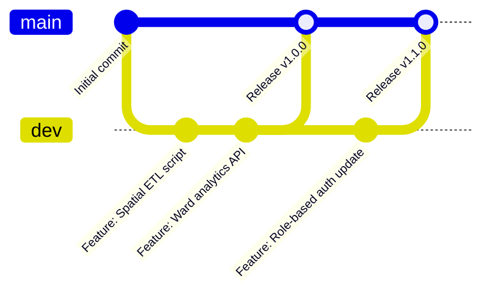

# Git Repository & Open-Source Collaboration — Solution Explorer

This document provides complete details about the **WELL Labs Solution Explorer** source code repository, branching model, local environment setup, and open-source contribution guidelines.

---

## 🌐 1. Repository Information

| Attribute | Details |
| :--- | :--- |
| **Repository Name** | `welllabs-solution-explorer-app` |
| **Organization Account** | `WELLlabs` |
| **SSH URL** | `git@github.com:WELLlabs/welllabs-solution-explorer-app.git` |
| **HTTPS URL** | `https://github.com/WELLlabs/welllabs-solution-explorer-app.git` |
| **License** | [ISC License](https://opensource.org/licenses/ISC) |

---

## 🌿 2. Branching & Deployment Strategy



* **`main` Branch**: Production-ready, stable codebase. Deployed directly to cloud environments (AWS EC2 / App Platform).
* **`dev` Branch**: Active development and staging branch where features are integrated before production releases.
* **Feature Branches** (`feature/<feature-name>`): Individual developer branches cut from `dev` for specific components or bug fixes.

---

## 💻 3. Local Repository Setup Guide

### Step 1: Clone the Repository
```bash
git clone git@github.com:WELLlabs/welllabs-solution-explorer-app.git
cd welllabs-solution-explorer-app
```

### Step 2: Install Backend Dependencies
```bash
cd backend
npm install
```

### Step 3: Configure Backend Environment Variables (`backend/.env`)
Create a `.env` file in `backend/` with the following variables:
```env
PORT=5000
MONGO_URI=mongodb+srv://<username>:<password>@cluster.mongodb.net/solution_explorer?retryWrites=true&w=majority
JWT_SECRET=your_jwt_secret_key_here
ADMIN_EMAIL=admin@ifmr.ac.in
GOOGLE_SHEET_ID=your_google_sheet_id_here
```

### Step 4: Install Frontend Dependencies & Start App
In a separate terminal window:
```bash
cd frontend
npm install
npm run dev
```

The application will launch locally at `http://localhost:5173`.

---

## 👥 4. Git User & Author Configuration

To ensure your contributions are correctly credited to your profile, configure Git locally or globally:

```bash
git config --global user.name "Your Name"
git config --global user.email "your.email@example.com"
```

---

## 🤝 5. Open-Source Contribution Workflow

We welcome contributions from researchers, hydrologists, GIS developers, and community members:

1. **Fork** the repository on GitHub.
2. **Create** your branch (`git checkout -b feature/YourFeatureName`).
3. **Commit** your changes cleanly (`git commit -m 'Add support for new GeoJSON layer'`).
4. **Push** to your branch (`git push origin feature/YourFeatureName`).
5. **Open a Pull Request** targeting the `dev` branch with a clear summary of your changes.
