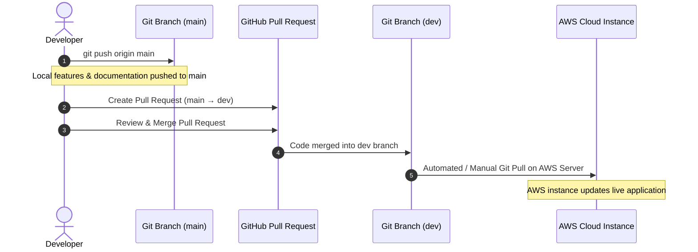

# Git Repository & Open-Source Collaboration — Solution Explorer

This document provides complete details about the **WELL Labs Solution Explorer** source code repository, branching model, local environment setup, AWS deployment workflow, and open-source contribution guidelines.

---

## 🌐 1. Repository Information

| Attribute | Details |
| :--- | :--- |
| **Repository Name** | `welllabs-solution-explorer-app` |
| **Organization Account** | `WELLlabs` |
| **SSH URL** | `git@github.com:WELLlabs/welllabs-solution-explorer-app.git` |
| **HTTPS URL** | `https://github.com/WELLlabs/welllabs-solution-explorer-app.git` |
| **License** | [ISC License](https://opensource.org/licenses/ISC) |

---

## 🌿 2. Branching & AWS Deployment Workflow

In this repository, the **`dev` branch is directly connected to the AWS deployment server**, while active code changes are committed and pushed to **`main`**.



### Branch Definitions
* **`main` Branch**: Primary development branch where code changes, features, and documentation updates are initially committed and pushed.
* **`dev` Branch**: **AWS Connected Deployment Branch**. Merging code into `dev` triggers or updates the live AWS server instance.

---

## 🚀 3. Step-by-Step Deployment Guide (main → dev → AWS)

To deploy new changes to the AWS environment:

1. **Commit and Push to `main`**:
   ```bash
   git add .
   git commit -m "Your descriptive feature commit message"
   git push origin main
   ```

2. **Merge `main` into `dev` via Git CLI or GitHub Pull Request**:
   * **Option A: Via GitHub Web UI**:
     * Open a Pull Request from `main` into `dev`.
     * Click **Merge Pull Request**.
   * **Option B: Via Git Command Line**:
     ```bash
     git checkout dev
     git pull origin dev
     git merge main
     git push origin dev
     git checkout main
     ```

3. **AWS Live Server Sync**:
   * Once merged into `dev`, the AWS server pulls the updated `dev` branch to update the live production web application.

---

## 💻 4. Local Repository Setup Guide

### Step 1: Clone the Repository
```bash
git clone git@github.com:WELLlabs/welllabs-solution-explorer-app.git
cd welllabs-solution-explorer-app
```

### Step 2: Install Backend Dependencies
```bash
cd backend
npm install
```

### Step 3: Configure Backend Environment Variables (`backend/.env`)
Create a `.env` file in `backend/` with the following variables:
```env
PORT=5000
MONGO_URI=mongodb+srv://<username>:<password>@cluster.mongodb.net/solution_explorer?retryWrites=true&w=majority
JWT_SECRET=your_jwt_secret_key_here
ADMIN_EMAIL=admin@ifmr.ac.in
GOOGLE_SHEET_ID=your_google_sheet_id_here
```

### Step 4: Install Frontend Dependencies & Start App
In a separate terminal window:
```bash
cd frontend
npm install
npm run dev
```

The application will launch locally at `http://localhost:5173`.

---

## 👥 5. Git User & Author Configuration

To ensure your contributions are correctly credited to your profile, configure Git locally or globally:

```bash
git config --global user.name "Your Name"
git config --global user.email "your.email@example.com"
```

---

## 🤝 6. Open-Source Contribution Guidelines

We welcome contributions from researchers, hydrologists, GIS developers, and community members:

1. **Fork** the repository on GitHub.
2. **Create** your branch (`git checkout -b feature/YourFeatureName`).
3. **Commit** your changes cleanly (`git commit -m 'Add support for new GeoJSON layer'`).
4. **Push** to your branch (`git push origin feature/YourFeatureName`).
5. **Open a Pull Request** targeting the `main` branch.
