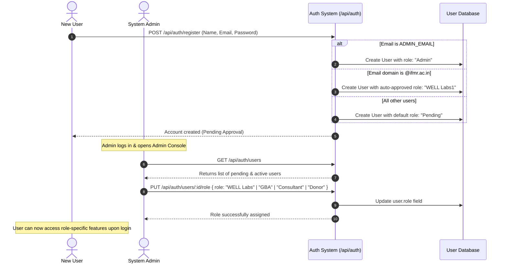

# Use-Case & Role-Based Access Mapping — Solution Explorer

The **WELL Labs Solution Explorer** enforces a strict Role-Based Access Control (RBAC) architecture. This document maps the application's exact user roles, the Admin approval & role assignment lifecycle, and the corresponding platform capabilities for each persona.

---

## 🔐 System User Roles & Access Control Matrix

When a new user creates an account, they enter a **`Pending`** status by default. An **`Admin`** user must approve and assign them one of the 4 primary organization roles via the User Management panel (`PUT /api/auth/users/:id/role`).

| System Role | Primary Target Users | Description & System Permissions | Key Capabilities & Platform Access |
| :--- | :--- | :--- | :--- |
| 🛡️ **Admin** | System Administrator | Full administrative privileges. Manages user registration requests, assigns roles, and overrides system settings. | • **User Management Panel**: Approve, reject, or reassign user roles. • Access all analytical dashboards & GIS map layers. • Data import & ETL management. |
| 🧪 **WELL Labs** *(WELL Labs1 / WELL Labs2)* | Core Organization Team & Researchers | Internal researchers, hydrologists, and GIS data analysts at WELL Labs. | • Full access to GIS map visualizers (Green, Blue, Grey, Wells). • Watershed & subcatchment impact analysis. • Data ingestion verification & dry-run inspection. |
| 🏛️ **GBA** | Greater Bengaluru Authority & Municipal Reps | Municipal officers, ward engineers, and government planning authorities. | • **Ward & Corporation Dashboards**: Track project progress, budget allocations, and drain lengths. • Filter analytics by municipal ward/corporation. |
| 📐 **Consultant** | Technical Consultants & Field Surveyors | External environmental consultants, field surveyors, and technical partners. | • View site-level interventions, spatial dimensions, and quantity metrics. • Open well water quality data access (pH, TDS, EC, salinity, contaminants). |
| 🤝 **Donor** | CSR Partners & Financial Donors | External funding partners, philanthropic organizations, and CSR executives. | • Transparent project budget, timeline, and status monitoring. • Case study showcase & impact summary views. |
| ⏳ **Pending** | Newly Registered Users | Default state upon registration until an Admin reviews and assigns a role. | • Restricted access: Awaits Admin role assignment before unlocking platform capabilities. |

---

## 🔄 User Role Assignment & Approval Lifecycle

---

## 💡 Core Use-Case Mapping by Role

### 1. Admin Role Assignment & Governance
* **Persona**: System Administrator
* **Workflow**:
  1. Admin logs into the dashboard and accesses the **User Management** tab.
  2. Views all registered users with their current status (`Pending`, `WELL Labs`, `GBA`, `Consultant`, `Donor`).
  3. Selects the appropriate role from the dropdown menu and confirms the update (`PUT /api/auth/users/:id/role`).
  4. The updated role immediately grants the user access to their corresponding dashboard capabilities.

---

### 2. Spatial Infrastructure & GIS Layer Discovery (WELL Labs & Consultants)
* **Persona**: WELL Labs Team & Technical Consultants
* **Workflow**:
  * Interactively toggle spatial overlays across Bengaluru:
    * 🟢 **Green Infrastructure**: Parks, campus greens, rain gardens, bioswales.
    * 🔵 **Blue Infrastructure**: Lakes, wetlands, retention/detention basins.
    * ⚪ **Grey Infrastructure**: Stormwater drains (SWDs), permeable pathways, ecobloc tanks.
    * 🚰 **Groundwater Wells**: Open wells and bore wells.
  * Inspect site-level and subcatchment-level environmental impact descriptions.

---

### 3. Municipal Ward Analytics & Project Tracking (GBA & Donors)
* **Persona**: GBA Municipal Authorities & CSR Donors
* **Workflow**:
  * Filter projects by **Corporation** or **Ward ID / Name**.
  * Track financial budget allocation, drain length constructed, and catchment area covered.
  * Monitor project implementation timelines and statuses (`Planning`, `In Progress`, `Completed`).

---

### 4. Groundwater Quality & Field Data Inspection (Consultants & WELL Labs)
* **Persona**: Field Surveyors & Hydrologists
* **Workflow**:
  * Query chemical water parameters for open wells across wards:
    * pH, Total Dissolved Solids (TDS), Electrical Conductivity (EC), Salinity.
    * Contamination indicators: Fluoride (`hasFluoride`) and Arsenic (`hasArsenic`).
  * Review physical attributes: Depth (ft), diameter (ft), lining, water level.
