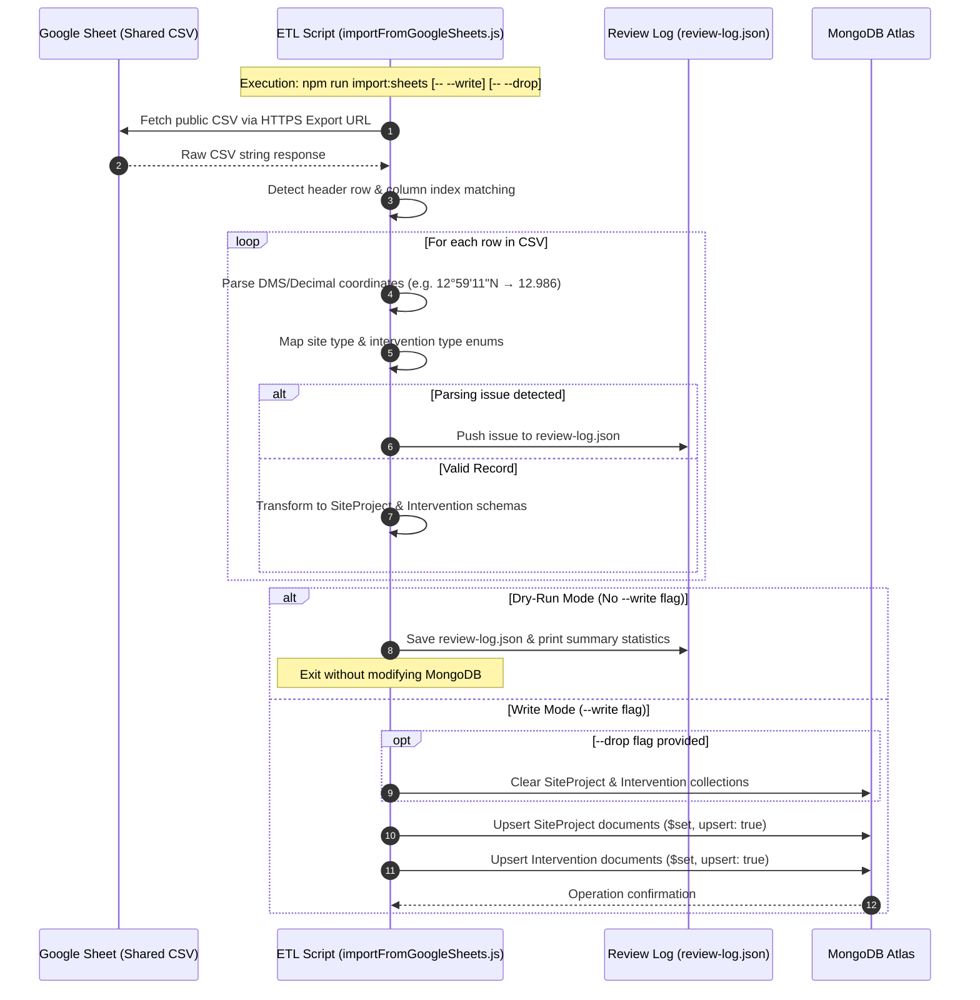
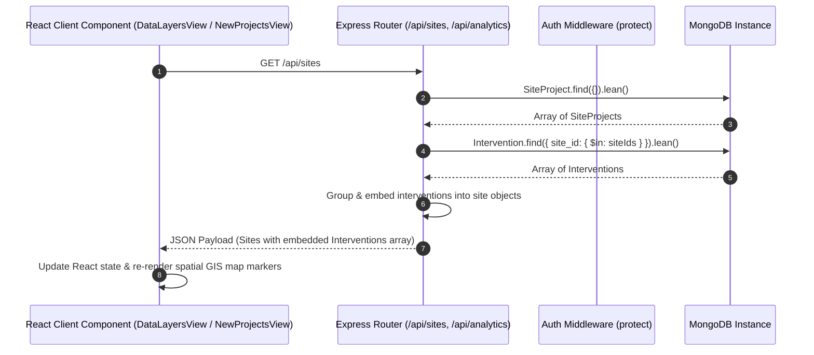
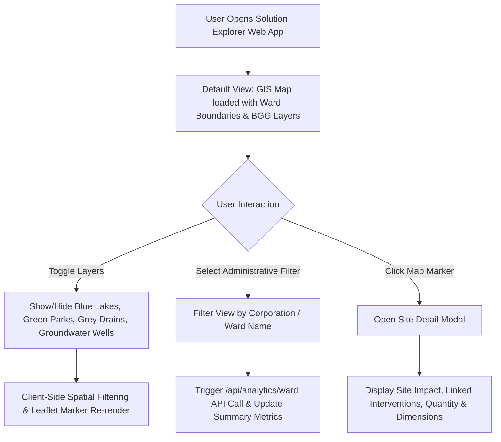

# Workflow & Dataflow Architecture — Solution Explorer

This document details the operational dataflows, ETL ingestion pipelines, API request-response lifecycles, and GIS user interaction workflows in the **WELL Labs Solution Explorer**.

---

## 🔄 1. Data Ingestion & ETL Workflow (Google Sheets → MongoDB)

---

## 🌐 2. API Request Dataflow (Frontend → Backend → DB)

---

## 🗺 3. GIS Interactive User Workflow

---

## ⚡ 4. Error Handling & Reliability Principles

1. **Defensive Coordinate Parsing**:
   * Accepts both DMS (`12°59'11.70"N`) and decimal float formats (`12.9865833`).
   * Fallback values prevent broken spatial geometries from disrupting map rendering.

2. **Geospatial Safety**:
   * GeoJSON points are only created when both valid latitude and longitude are present.

3. **Data Integrity via Upserts**:
   * Re-running imports updates existing documents based on `site_id` and `intervention_id` rather than creating duplicates.
