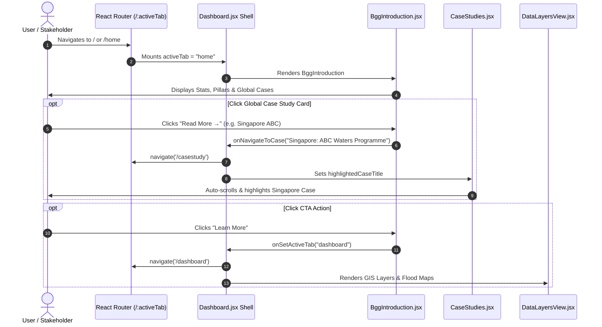

# 🌊 Solution Explorer — Frontend Comprehensive Documentation
> **Module Focus: Tab 1 — Home View (`/home`)**  
> **Source Component:** [`frontend/src/components/dashboard/BggIntroduction.jsx`](file:///c:/Users/welll/Desktop/bangalore%20mern%20application/frontend/src/components/dashboard/BggIntroduction.jsx)  
> **Layout Shell:** [`frontend/src/pages/Dashboard.jsx`](file:///c:/Users/welll/Desktop/bangalore%20mern%20application/frontend/src/pages/Dashboard.jsx) & [`frontend/src/components/layout/Header.jsx`](file:///c:/Users/welll/Desktop/bangalore%20mern%20application/frontend/src/components/layout/Header.jsx)  
> **Target Audience:** Urban Planners, Hydrologists, Frontend Engineers, GIS Specialists, CSR Donors, and Government Stakeholders (GBA/BBMP).

---

## 📑 Table of Contents
1. [Executive Summary & Purpose](#1-executive-summary--purpose)
2. [Global Navigation & Workspace Header](#2-global-navigation--workspace-header)
3. [Section 1: Hero Crisis Header & Extreme Weather Telemetry](#3-section-1-hero-crisis-header--extreme-weather-telemetry)
4. [Section 2: Platform Overview & Core Capabilities Matrix](#4-section-2-platform-overview--core-capabilities-matrix)
5. [Section 3: Conceptual Architecture — "What is Solutions Explorer?"](#5-section-3-conceptual-architecture--what-is-solutions-explorer)
6. [Section 4: The Blue-Green-Grey (BGG) Framework & Asset Taxonomy](#6-section-4-the-blue-green-grey-bgg-framework--asset-taxonomy)
7. [Section 5: Global Case Studies & Benchmark Telemetry](#7-section-5-global-case-studies--benchmark-telemetry)
8. [Section 6: Call to Action (CTA) & Deep-Link Navigation](#8-section-6-call-to-action-cta--deep-link-navigation)
9. [Technical Architecture & State Flow](#9-technical-architecture--state-flow)

---

## 1. Executive Summary & Purpose

The **Home Tab (`/home`)** serves as the primary landing dashboard and narrative anchor for the **Bengaluru Urban Water Resilience Decision Support System (Solution Explorer)**. 

### Key Objectives
* **Contextualize Bangalore's Flood Crisis:** Presents quantitative climate telemetry (rainfall intensity, recurrence intervals, drainage deficits) that illustrate the urgency of urban hydrological transformation.
* **Introduce Nature-Based Blue-Green-Grey (BGG) Engineering:** Demystifies the synergy between ecological retention (Blue/Green) and civil drainage (Grey).
* **Demonstrate Global Viability:** Showcases proven international urban flood mitigation models (Singapore, Copenhagen, Rotterdam) with real financial and hydraulic metrics.
* **Guide Stakeholder Action:** Connects municipal decision-makers, CSR partners, and citizen scientists to interactive GIS maps, design calculators, and live project trackers.

---

## 2. Global Navigation & Workspace Header

The top of the Home view contains the persistent application header and workspace tab bar.

```
┌────────────────────────────────────────────────────────────────────────────────────────┐
│ ⬡ Solution Explorer — WELL Labs & Citizen Hydrology Hub    [👤 User | Role | Sign Out] │
├────────────────────────────────────────────────────────────────────────────────────────┤
│  [🏠 Home (Active)]    [📖 Case Study]    [📊 Dashboard / GIS Map]    [⚙️ Admin]        │
└────────────────────────────────────────────────────────────────────────────────────────┘
```

### Key Sub-Components
1. **Brand Identity Block:** Displays the multi-layered hex logo, application title (`Solution Explorer`), and institutional subtitle (`WELL Labs & Citizen Hydrology Hub`).
2. **User Authentication & RBAC Badge:**
   * Shows the current authenticated user's name.
   * Renders color-coded Role Badges (`Admin`, `WELL Labs1`, `WELL Labs2`, `Consultant`, `GBA`, `Donor`).
   * Includes the **Sign Out** button linked to `AuthContext.logout()`.
3. **Workspace Navigation Tabs:**
   * **Home (`/home`):** Conceptual introduction, climate statistics, framework pillars, and case studies.
   * **Case Study (`/casestudy`):** Deep-dive global case study explorer.
   * **Dashboard (`/dashboard`):** Interactive Leaflet GIS mapping engine with multi-layer overlays (Wells, Projects, Flood Risks, Catchments).
   * **User Management (`/usermanagement`):** Admin-exclusive role assignment and permissions control panel.

---

## 3. Section 1: Hero Crisis Header & Extreme Weather Telemetry

The hero banner immediately focuses attention on Bengaluru's monsoon vulnerability with verified meteorological data points.

### Visual Presentation
* **Background:** Soft indigo gradient container (`from-[#eef2ff] to-[#e0e7ff]`) with rounded corners (`rounded-[20px]`) and subtle indigo box-shadow.
* **Main Headline:** *"Bangalore is flooding. Every monsoon season."*
* **Narrative Context:** Explains how rapid impervious surface expansion, lake encroachment, and extreme precipitation anomalies led to the severe 2022 deluge.

### Climate Telemetry Cards (4 Key Indicators)
```
┌─────────────────────────┬─────────────────────────┬─────────────────────────┬─────────────────────────┐
│       1,400 mm          │         5 of 7          │        131.6 mm         │          ↑30%           │
│  Rainfall in 2022 vs    │  Years since 2015 had   │  Deluge recorded in 12  │   Increase in extreme   │
│   970 mm historical avg │    excess rainfall      │   hours during 2022     │     rainfall events     │
└─────────────────────────┴─────────────────────────┴─────────────────────────┴─────────────────────────┘
```

| Metric | Technical Meaning | Hydrological Implication |
| :--- | :--- | :--- |
| **`1,400 mm`** | Annual rainfall in 2022 | Nearly **50% above normal baseline** (970 mm), exceeding the carrying capacity of concrete stormwater drains. |
| **`5 of 7 Years`** | Recurrence frequency since 2015 | Proves extreme monsoon events are no longer anomalies, but the **new climatic normal**. |
| **`131.6 mm in 12h`** | Peak cloudburst intensity | Represents a high-intensity short-duration storm that causes rapid catchment saturation and flash flooding. |
| **`↑30% Increase`** | Severe precipitation trend | Demonstrates the compounding effect of urban heat islands and climate change on Bangalore's storm frequency. |

---

## 4. Section 2: Platform Overview & Core Capabilities Matrix

This section outlines how **Solution Explorer** transforms urban water management from reactive disaster response to proactive, data-driven engineering.

### Section Statement
> *"Bangalore's flood problem has a blueprint. Blue-green-grey infrastructure, modeled and costed for our city."*

### 4 Platform Capability Cards
```
┌───────────────────────────────┬───────────────────────────────┐
│ 🔍 Automated Suitability      │ 🧮 Design Calculator          │
│ Spatial gap analysis & GIS    │ Hydrological sizing, runoff   │
│ flood risk overlay algorithms │ routing, and civil costing    │
├───────────────────────────────┼───────────────────────────────┤
│ 📊 Real-Time Tracking         │ 🤝 Collaborative Network      │
│ Water table depth, telemetry  │ Multi-stakeholder CSR, GBA,   │
│ sensors, and ward metrics     │ and citizen implementer hub   │
└───────────────────────────────┴───────────────────────────────┘
```

1. **🔍 Automated Suitability:**
   * Uses spatial multi-criteria evaluation (elevation, slope, soil permeability, flood hotspot proximity) to identify the highest-impact locations for nature-based interventions.
2. **🧮 Design Calculator:**
   * Automatically calculates hydraulic storage capacity, infiltration volume, and cost estimates (in ₹ Lakhs/Crores) for specific intervention types.
3. **📊 Real-Time Tracking:**
   * Ingests field sensor telemetry to monitor open well water levels, groundwater recharge rates, and post-monsoon water table recovery.
4. **🤝 Collaborative Network:**
   * Unifies BBMP/GBA authorities, CSR funding partners, research institutions (WELL Labs), and local citizen groups into a single operational workspace.

---

## 5. Section 3: Conceptual Architecture — "What is Solutions Explorer?"

A dual-column section explaining the platform's vision paired with an animated spatial icon.

```
┌─────────────────────────────────────────────────────────────┬──────────────────┐
│ What is Solutions Explorer?                                 │                  │
│                                                             │       🗺️        │
│ • Data-driven Decision Support System (DSS) for BGG assets. │ (Floating GIS    │
│ • Generates flood risk maps, automated designs, and budgets.│  Vector Icon)    │
│ • Unifies government, CSR, implementers, and researchers.   │                  │
└─────────────────────────────────────────────────────────────┴──────────────────┘
```

### Core Architecture Pillars
* **Data-Driven Decision Support System (DSS):** Replaces subjective project selection with quantitative hydrology models.
* **Integrated Hydraulic Modeling:** Simulates stormwater capture across micro-watersheds before capital is committed.
* **Cross-Sector Transparency:** Standardizes project progress, expenditure tracking, and ecological impact metrics.

---

## 6. Section 4: The Blue-Green-Grey (BGG) Framework & Asset Taxonomy

This section provides a clear, standardized taxonomy of Blue-Green-Grey infrastructure for municipal stakeholders.

### The Three Framework Pillars

```
┌───────────────────────────────┬───────────────────────────────┬───────────────────────────────┐
│ 🔵 Blue                       │ 🟢 Green                      │ ⚫ Grey                       │
│ Water bodies, lakes, wetlands │ Vegetation, bio-swales, parks │ Concrete drains, pipes, tanks │
│ and natural recharge zones    │ and permeable green cover     │ and engineered inlet conduits │
└───────────────────────────────┴───────────────────────────────┴───────────────────────────────┘
```

### Signature Nature-Based Interventions Catalog

| Icon | Intervention Asset | Functional Mechanism & Impact |
| :---: | :--- | :--- |
| 💧 | **Recharge Wells** | Perforated cylindrical masonry/concrete shafts (10–30 ft deep) that filter and inject surface runoff directly into shallow unconfined aquifers, raising the groundwater table. |
| 🌸 | **Bioswales & Rain Gardens** | Gently sloped vegetated channels with engineered filter media and native plants that slow runoff velocity, trap suspended sediment, and remove heavy metals. |
| 🌳 | **Urban Forests & Tree Parks** | High-density urban canopies (e.g. Kadugodi Tree Park) that intercept raindrops, reduce surface velocity, enhance soil porosity, and mitigate urban heat islands. |
| 🌊 | **Lake Restoration & Buffers** | Desilting lake beds, restoring wetland inlet marshes, and building perimeter bund bioswales to maximize flood buffer capacity and prevent downstream inundation. |

---

## 7. Section 5: Global Case Studies & Benchmark Telemetry

Demonstrates how global metropolitan cities successfully transitioned from concrete-only drainage to resilient Blue-Green systems.

```
┌───────────────────────────────┬───────────────────────────────┬───────────────────────────────┐
│ 🇸🇬 Singapore                  │ 🇩🇰 Copenhagen                 │ 🇳🇱 Rotterdam                  │
│ ABC Waters Programme          │ Cloudburst Plan               │ Room for the River            │
│ ───────────────────────────── │ ───────────────────────────── │ ───────────────────────────── │
│ 48% Risk Area Reduced         │ €800M Storm Damage in 2011    │ €2.3B Total Investment        │
│ 22-63% Runoff Reduction       │ €1.5B Total Green Investment  │ 30+ Locations on 4 Rivers     │
│ 30 min Discharge Delay        │ €200M+ Saved over Pipes       │ 16,000 m³/s Swell Capacity    │
│ 60+ Projects Implemented      │ 300 Masterplan Projects       │ 2023 Flood Averted Safely     │
│ [Read More →]                 │ [Read More →]                 │ [Read More →]                 │
└───────────────────────────────┴───────────────────────────────┴───────────────────────────────┘
```

### Interactive Features
* **Hover Animation:** Cards lift with warm amber border highlights (`hover:border-amber-400`).
* **2×2 Mini Metric Dashboard:** Each card embeds a high-contrast metric grid highlighting hydraulic performance and capital savings.
* **Seamless Navigation Trigger:** Clicking **"Read More →"** passes the case study title to `onNavigateToCase(title)` and opens the dedicated Case Study tab with the card pre-highlighted.

---

## 8. Section 6: Call to Action (CTA) & Deep-Link Navigation

The concluding section guides the user from conceptual understanding to active workspace exploration.

### CTA Layout & Content
* **Headline:** *"Ready to build BGG in Bangalore?"*
* **Subtext:** Promotes the use of spatial gap analysis to identify underserved flood hotspots and optimize capital allocation.
* **Interactive Button:** **"Learn More"** — executes `onSetActiveTab('floodriskmap')` to navigate directly to the interactive flood risk map and project explorer.

---

## 9. Technical Architecture & State Flow



### Component Code Summary
* **Component Name:** `BggIntroduction`
* **Props Accepted:**
  * `onNavigateToCase(targetCaseTitle: string)`: Navigation callback to the Case Studies tab.
  * `onSetActiveTab(tabName: string)`: Router tab switcher callback.
* **Styling System:** Tailwind CSS utility classes + dynamic CSS keyframes (`floatIcon`, `fadeIn`).
* **Dependencies:** Zero external API calls required on initial render (renders instantaneously from curated hydrological datasets).
